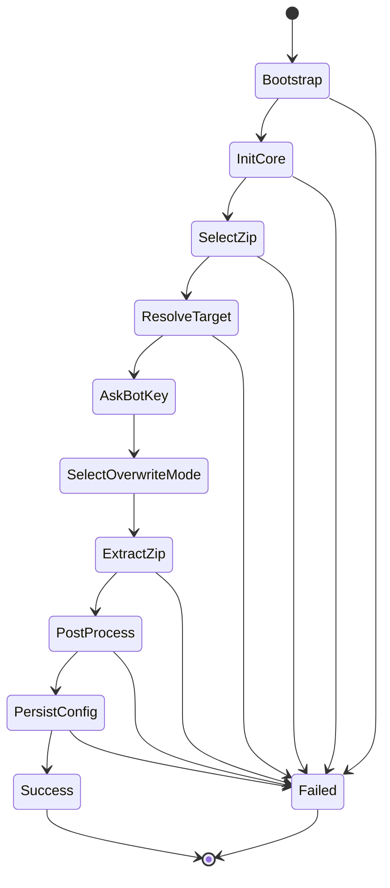
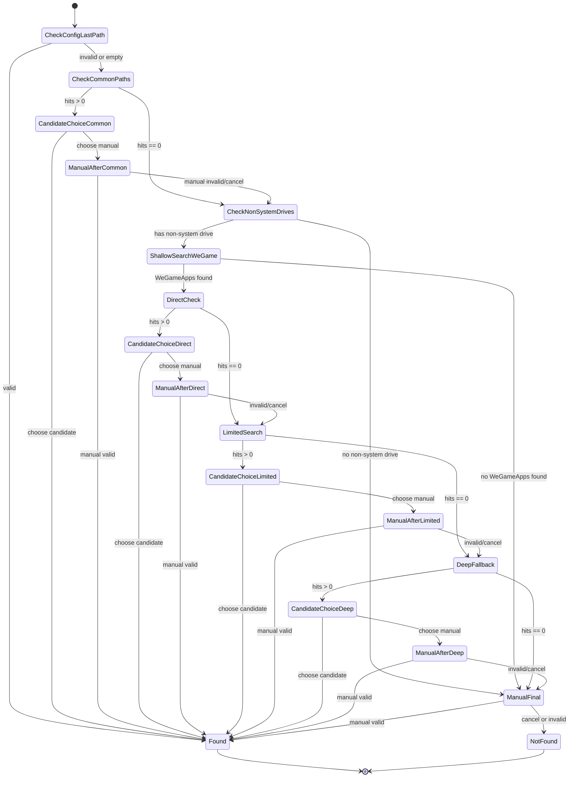
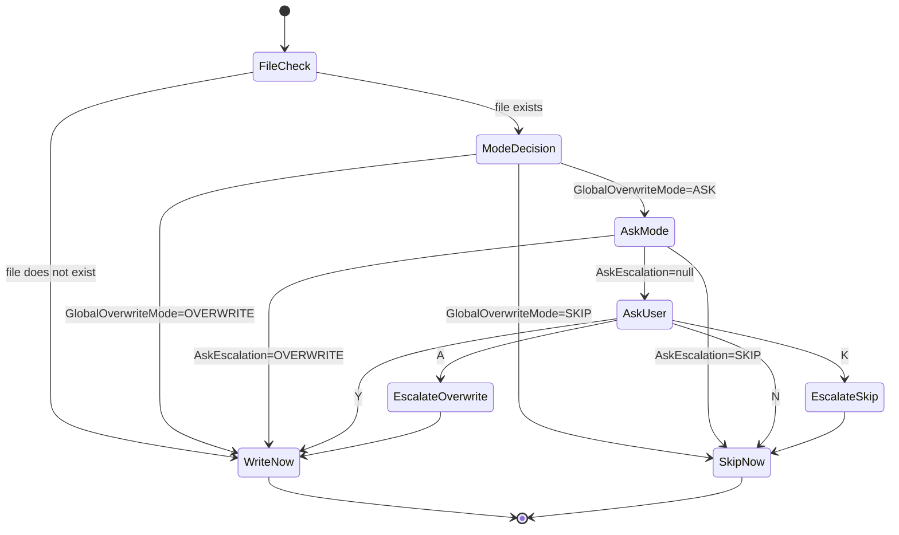

下面是可直接保存为 `DESIGN_FOR_AI.md` 的内容。

---

# WeGame ZIP Installer - 面向 AI / 代码分析器的设计文档

## 1. 文档目的

本文档面向：

- 代码分析器
- 另一个 AI
- 维护/重构该脚本的开发者

目标：

1. 说明该脚本的**架构边界**
2. 给出**主流程伪代码**
3. 描述**数据流**
4. 描述**状态流**
5. 给出**函数依赖图**
6. 标记**隐式耦合、全局状态、副作用和兼容性约束**

---

## 2. 系统摘要

该脚本是一个**单文件 BAT + 内嵌 PowerShell** 的安装器。

核心业务语义：

- 用户选择一个 ZIP
- 只从 ZIP 中提取 `league of legends/` 这一棵目录
- 将它解压到目标目录 `英雄联盟体验服\Game`
- 对本次成功写入的文件做后处理：
  - 所有 `user.ini` 写入用户输入的 BOT 卡密
  - 所有 `core_cn.dll` 重命名为 `hid.dll`
- 把最终目标路径保存到 `config.ini` 的 `last_path`

---

## 3. 架构边界

## 3.1 双层结构

### 第 1 层：BAT 启动器
职责：

- 创建临时目录
- 从自身文件中抽取 PowerShell payload
- 写出临时 `core.ps1`
- 调用 `powershell.exe` 执行
- 执行结束后清理临时目录

### 第 2 层：PowerShell 核心
职责：

- 日志与输出
- 配置读取/写回
- ZIP 选择
- 游戏目录搜索
- 解压
- 覆盖冲突决策
- 后处理
- 失败兜底和错误输出

---

## 3.2 输入输出边界

### 输入
- BAT 文件自身
- 用户选择的 ZIP 文件
- `config.ini`（可选）
- 用户交互输入：
  - ZIP 路径
  - 目标目录
  - BOT 卡密
  - 覆盖策略

### 输出
- 目标 `Game` 目录中的文件
- `<ScriptRoot>\config.ini`
- `<ScriptRoot>\wg_installer_*.log`
- 临时 `<WorkDir>\manifest.txt`（最终随临时目录删除）

---

## 4. 运行时路径模型

## 4.1 关键路径定义

### `ScriptRoot`
BAT 脚本所在目录。

用途：
- `config.ini` 所在目录
- 日志文件输出目录
- ZIP 选择框默认目录

### `WorkDir`
临时工作目录，一般为：

```text
%TEMP%\WGZipInstaller\run_<random>\
```

用途：
- 存放临时 `core.ps1`
- 存放 `manifest.txt`

### `TargetRoot`
目标游戏根目录，语义上应为：

```text
...\英雄联盟体验服
```

### `GameDir`
实际写入目录：

```text
$TargetRoot\Game
```

### `Manifest`
本次实际写入成功的文件绝对路径列表。

用途：
- 后处理只针对这些文件
- 不处理“已存在但被跳过”的旧文件

---

## 5. 全局状态与隐式状态

## 5.1 显式脚本级可变状态

| 变量 | 作用域 | 写入位置 | 读取位置 | 含义 |
|---|---|---|---|---|
| `$script:ConfigFile` | script | main | `Resolve-TargetRoot`, `Save-ConfigValues` | config 路径 |
| `$script:LogFile` | script | main | `Write-Log`, catch | 日志路径 |
| `$script:GlobalOverwriteMode` | script | `Extract-GameZipSubset` | `Should-WriteFile` | 全局覆盖模式 |
| `$script:AskEscalation` | script | `Extract-GameZipSubset`, `Should-WriteFile` | `Should-WriteFile` | ASK 模式下“后续全部覆盖/全部跳过”的升级状态 |

---

## 5.2 环境变量输入

BAT 层设置并传递给 PowerShell：

| 环境变量 | 含义 |
|---|---|
| `__WG_SCRIPT_DIR` | 脚本目录 |
| `__WG_WORK_DIR` | 临时工作目录 |
| `__WG_ZIP_PATH` | BAT 第一个参数，作为 ZIP 初始值 |
| `SELF_PATH` | BAT 自身绝对路径 |
| `PS_MARKER` | PowerShell payload 起始标记 |
| `CORE_PS1` | 临时导出的 core.ps1 路径 |

PowerShell core 的参数若为空，会回退读取这些环境变量。

---

## 5.3 隐式依赖 / 动态作用域依赖

以下函数存在**非参数式依赖**：

### `Select-ZipFileInteractive`
依赖外部变量 `$ScriptRoot` 作为 `OpenFileDialog.InitialDirectory`。

这是 PowerShell 动态作用域带来的隐式耦合。
静态分析器应视为：

- 该函数不仅依赖参数
- 还依赖调用上下文中已绑定的 `$ScriptRoot`

### `Resolve-TargetRoot`
依赖：

- `$script:ConfigFile`
- `$env:SystemDrive`

### `Write-Log`
依赖：

- `$script:LogFile`

### `Should-WriteFile`
依赖并修改：

- `$script:GlobalOverwriteMode`
- `$script:AskEscalation`

---

## 6. 主要数据结构

## 6.1 DriveObject

由 `Get-FixedDriveObjects` 生成：

```powershell
[pscustomobject]@{
    Root     = 'D:'
    RootPath = 'D:\'
    IsSystem = $false
}
```

---

## 6.2 ExtractResult

由 `Extract-GameZipSubset` 返回：

```powershell
[pscustomobject]@{
    Manifest = <string[]>
    Stats    = [pscustomobject]@{
        Total       = <int>
        New         = <int>
        Overwritten = <int>
        Skipped     = <int>
    }
    GameDir  = <string>
}
```

---

## 6.3 PostProcessResult

由 `Invoke-PostProcess` 返回：

```powershell
[pscustomobject]@{
    BotWritten = <int>
    Renamed    = <int>
}
```

---

## 6.4 Config Map

由 `Load-Config` 返回的 Hashtable：

```powershell
@{
    last_path = 'E:\WeGameApps\英雄联盟体验服'
}
```

---

## 7. 设计约束与不变量

## 7.1 目标目录不变量

合法目标目录定义为：

```text
<Root>
└─ Game
```

其中 `<Root>` 是“英雄联盟体验服”根目录。
用户手动选择时可选：

- `...\英雄联盟体验服`
- `...\英雄联盟体验服\Game`

但 `Get-TargetRoot` 最终统一返回根目录。

---

## 7.2 ZIP 根目录不变量

ZIP 中只处理前缀为：

```text
league of legends/
```

的条目，大小写不敏感。

若 ZIP 不包含这一前缀，安装失败。

---

## 7.3 后处理不变量

后处理只对 **manifest 中本次实际写入成功的文件** 生效。

即：

- 跳过的旧 `user.ini` 不会写 BOT 卡密
- 跳过的旧 `core_cn.dll` 不会被重命名

---

## 7.4 PowerShell 5.1 兼容性不变量

所有需要 `.Count` / `[0]` 的函数返回结果，调用方通常用：

```powershell
@(...)
```

包裹，以避免单元素返回值退化为标量对象导致 `.Count` 报错。

---

## 8. 主流程伪代码

## 8.1 BAT 启动层伪代码

```text
set ScriptDir = BAT 所在目录
set WorkRoot  = %TEMP%\WGZipInstaller
set WorkDir   = WorkRoot\run_<random>
set CorePs1   = WorkDir\core.ps1
set SelfPath  = 当前 BAT 路径
set Marker    = "#__POWERSHELL_BELOW__"

create WorkRoot if missing
create WorkDir  if missing
if WorkDir create failed:
    print error
    exit 1

run powershell command:
    read SelfPath bytes
    detect encoding:
        if UTF8 BOM -> UTF8
        else -> system default
    read all lines
    find Marker line
    payload = lines after Marker
    write payload to CorePs1 as UTF8 BOM

if extraction failed:
    print error
    delete WorkDir
    exit 1

run:
    powershell -NoProfile -ExecutionPolicy Bypass -STA -File CorePs1

capture EXITCODE
delete WorkDir

if EXITCODE != 0:
    pause

exit EXITCODE
```

---

## 8.2 PowerShell 主流程伪代码

```text
init:
    StrictMode = Latest
    ErrorActionPreference = Stop
    setup UTF-8 console encoding
    initialize script globals

resolve runtime params:
    ScriptRoot = parameter or env __WG_SCRIPT_DIR
    WorkDir    = parameter or env __WG_WORK_DIR
    ZipPath    = parameter or env __WG_ZIP_PATH

normalize and validate ScriptRoot / WorkDir
ensure WorkDir exists

set:
    ConfigFile   = ScriptRoot\config.ini
    LogFile      = ScriptRoot\wg_installer_<timestamp>.log
    ManifestFile = WorkDir\manifest.txt

cleanup old temp dirs
show banner
log run start

zipFile = Resolve-ZipInput(ZipPath)
if zipFile empty -> throw

print selected zip
log zip path

targetRoot = Resolve-TargetRoot()
if targetRoot empty -> throw

print target root

botKey = Read-Host("请输入 BOT 卡密（直接回车跳过）")
if blank -> null

mode = Prompt-OverwriteMode()
log mode

extractResult = Extract-GameZipSubset(zipFile, targetRoot, mode, ManifestFile)
postResult    = Invoke-PostProcess(extractResult.Manifest, botKey)

Save-ConfigValues(config.ini, { last_path = targetRoot })
log save config

print summary
log success
exit 0

catch any exception:
    print error
    log error + ScriptStackTrace if possible
    print log path
    exit 1
```

---

## 8.3 目标目录搜索伪代码

```text
function Resolve-TargetRoot:
    start stopwatch
    config = Load-Config(ConfigFile)
    lastPath = config['last_path']

    step "检查 config.ini 的 last_path"
    if lastPath not blank:
        valid = Get-TargetRoot(lastPath)
        if valid:
            return Finish-Resolve(valid, source="config.ini")
        else:
            warn "last_path 已失效"
    else:
        info "last_path 为空"

    drives = @(Get-FixedDriveObjects(SystemDrive))
    if drives empty:
        throw "未检测到固定磁盘"

    log all drives

    step "检查常见固定路径"
    commonHits = []
    for candidate in @(Get-CommonCandidateRoots(drives)):
        valid = Get-TargetRoot(candidate)
        if valid:
            commonHits.add(valid)
    commonHits = unique(commonHits)

    if commonHits not empty:
        choice = Prompt-CandidateChoice(commonHits)
        if choice == "__MANUAL__":
            manual = Try-Select-ManualTarget(lastPath)
            if manual:
                return Finish-Resolve(manual, "manual-after-common")
        else if choice:
            return Finish-Resolve(choice, "common-path")

    nonSystemDrives = drives where IsSystem == false

    if nonSystemDrives empty:
        warn "未发现非系统盘，跳过浅搜索"
    else:
        step "自动搜索非系统盘中的 WeGameApps"

        weGameRoots = []
        for drive in nonSystemDrives:
            found = @(Find-WeGameAppsShallow(drive.RootPath, depth=3))
            add found to weGameRoots
        weGameRoots = unique(weGameRoots)

        if weGameRoots not empty:
            step "直查 WeGameApps\英雄联盟体验服"
            directHits = []
            for wg in weGameRoots:
                hit = Find-LolDirectUnderWeGame(wg)
                if hit: add hit
            directHits = unique(directHits)

            if directHits not empty:
                choice = Prompt-CandidateChoice(directHits)
                if choice == "__MANUAL__":
                    manual = Try-Select-ManualTarget(lastPath)
                    if manual:
                        return Finish-Resolve(manual, "manual-after-direct")
                else if choice:
                    return Finish-Resolve(choice, "direct-under-wegameapps")

            step "有限深度搜索"
            limitedHits = []
            for wg in weGameRoots:
                add @(Find-LolLimitedDepth(wg, 2)) to limitedHits
            limitedHits = unique(limitedHits)

            if limitedHits not empty:
                choice = Prompt-CandidateChoice(limitedHits)
                if choice == "__MANUAL__":
                    manual = Try-Select-ManualTarget(lastPath)
                    if manual:
                        return Finish-Resolve(manual, "manual-after-limited")
                else if choice:
                    return Finish-Resolve(choice, "limited-depth")

            step "深度兜底搜索"
            deepHits = []
            for wg in weGameRoots:
                add @(Find-LolDeepFallback(wg)) to deepHits
            deepHits = unique(deepHits)

            if deepHits not empty:
                choice = Prompt-CandidateChoice(deepHits)
                if choice == "__MANUAL__":
                    manual = Try-Select-ManualTarget(lastPath)
                    if manual:
                        return Finish-Resolve(manual, "manual-after-deep")
                else if choice:
                    return Finish-Resolve(choice, "deep-fallback")

    step "未自动找到目标目录，请手动选择"
    manualFinal = Try-Select-ManualTarget(lastPath)
    return Finish-Resolve(manualFinal, "manual-final")
```

---

## 8.4 解压伪代码

```text
function Extract-GameZipSubset(zipPath, targetRoot, overwriteMode, manifestFile):
    step "开始解压 ZIP"
    load System.IO.Compression assemblies

    gameDir = targetRoot\Game
    if gameDir does not exist:
        throw

    GlobalOverwriteMode = overwriteMode
    AskEscalation = null

    manifest = []
    stats = { Total=0, New=0, Overwritten=0, Skipped=0 }

    zip = OpenRead(zipPath)
    prefix = "league of legends/"

    entries = all zip entries where entry.FullName starts with prefix (case-insensitive)
    if entries empty:
        throw "ZIP 中未找到 league of legends 根目录内容"

    for each entry in entries:
        normalized = entry.FullName with '\' replaced by '/'
        relative = substring after prefix

        if relative empty:
            continue

        if normalized ends with '/':
            dirPath = Get-SafeDestinationPath(gameDir, relative)
            if dirPath:
                create dirPath
            continue

        destination = Get-SafeDestinationPath(gameDir, relative)
        if destination empty:
            continue

        stats.Total++

        exists = destination file exists

        if not Should-WriteFile(destination):
            stats.Skipped++
            continue

        Copy-ZipEntryToFile(entry, destination)

        if exists:
            stats.Overwritten++
        else:
            stats.New++

        manifest.add(destination)

    close zip

    manifest = unique(manifest)
    write manifestFile as UTF8 BOM
    log stats

    return { Manifest, Stats, GameDir }
```

---

## 8.5 后处理伪代码

```text
function Invoke-PostProcess(manifest, botKey):
    step "执行后处理"

    files = unique(manifest where file still exists)

    botCount = 0
    renameCount = 0

    if botKey not blank:
        userIniFiles = files where filename == "user.ini"
        for file in userIniFiles:
            overwrite file content with botKey using UTF8 no BOM
            botCount++
        log botCount
    else:
        log "跳过 user.ini 写入"

    dllFiles = files where filename == "core_cn.dll"
    for file in dllFiles:
        dir  = parent directory
        dest = dir\hid.dll

        if dest exists:
            delete dest

        rename file -> hid.dll
        renameCount++

    log renameCount

    return { BotWritten = botCount, Renamed = renameCount }
```

---

## 9. 数据流设计

## 9.1 宏观数据流

```text
BAT 自身文件
  -> 提取 PowerShell payload
  -> 临时 core.ps1
  -> 执行核心逻辑

用户输入 / config.ini / 自动搜索
  -> 目标目录解析
  -> TargetRoot

ZIP 文件
  -> 过滤出 league of legends/*
  -> 安全路径映射到 GameDir
  -> 写入目标文件
  -> 生成 manifest

manifest + BOT 卡密
  -> user.ini 写入 / DLL 重命名

最终 TargetRoot
  -> 写回 config.ini:last_path

运行过程
  -> 写入 log 文件
```

---

## 9.2 数据源 -> 转换 -> 数据汇

### A. ZIP 路径流

```text
BAT 参数 %1
  -> env:__WG_ZIP_PATH
  -> PowerShell 参数 ZipPath 回填
  -> Resolve-ZipInput
      -> Normalize-PathString
      -> 若为空则弹窗选择
      -> 路径存在性与 .zip 扩展名检查
  -> zipFile
```

### B. 目标目录流

```text
config.ini:last_path
  -> Resolve-TargetRoot
      -> Get-TargetRoot(valid?)
      -> 若无效则继续自动搜索
      -> 常见路径 / 浅搜索 / 有限深度 / 深度兜底 / 手动选择
  -> targetRoot
  -> Save-ConfigValues(last_path=targetRoot)
  -> config.ini
```

### C. ZIP 条目流

```text
zip.Entries
  -> 前缀过滤 league of legends/
  -> 计算相对路径 relative
  -> Get-SafeDestinationPath(GameDir, relative)
  -> 覆盖决策 Should-WriteFile
  -> Copy-ZipEntryToFile
  -> manifest[]
  -> Invoke-PostProcess(manifest)
```

### D. BOT 卡密流

```text
Read-Host(BOT 卡密)
  -> botKey
  -> Invoke-PostProcess
  -> 每个 manifest 中命中的 user.ini
```

### E. 覆盖模式流

```text
Prompt-OverwriteMode
  -> GlobalOverwriteMode
  -> Should-WriteFile
      -> 如为 ASK 模式，可能更新 AskEscalation
```

---

## 9.3 文件系统副作用图

| 操作 | 读 | 写 | 删 | 重命名 |
|---|---:|---:|---:|---:|
| BAT payload 提取 | BAT 自身 | `core.ps1` | 旧 WorkDir（可选） | 否 |
| `Load-Config` | `config.ini` | 否 | 否 | 否 |
| `Save-ConfigValues` | 旧 `config.ini` | 新 `config.ini` | 否 | 否 |
| `Resolve-TargetRoot` | 枚举磁盘/目录 | 否 | 否 | 否 |
| `Extract-GameZipSubset` | ZIP / 目标目录状态 | 目标文件 / manifest | 否 | 否 |
| `Invoke-PostProcess` | manifest 文件集合 | `user.ini` 新内容 | 可能删旧 `hid.dll` | `core_cn.dll -> hid.dll` |
| BAT 清理 | WorkDir | 否 | WorkDir | 否 |

---

## 10. 状态流设计

## 10.1 整体运行状态机



---

## 10.2 目标目录搜索状态机



---

## 10.3 覆盖决策状态机

脚本分两层状态：

- `GlobalOverwriteMode`：`ASK` / `OVERWRITE` / `SKIP`
- `AskEscalation`：仅在 `ASK` 下使用，初始为 `null`

### 状态定义

| 状态 | 含义 |
|---|---|
| `OVERWRITE` | 所有冲突文件直接覆盖 |
| `SKIP` | 所有冲突文件直接跳过 |
| `ASK + null` | 每个冲突单独询问 |
| `ASK + OVERWRITE` | 用户曾选择 A，后续所有冲突自动覆盖 |
| `ASK + SKIP` | 用户曾选择 K，后续所有冲突自动跳过 |

### 决策状态机



---

## 11. 函数依赖图

## 11.1 顶层依赖图（Mermaid）

```mermaid
graph TD
    BAT[BAT Bootstrap] --> CorePS1[生成临时 core.ps1]
    CorePS1 --> Main[PowerShell Main try/catch]

    Main --> ResolveFullPathStrict
    Main --> CleanupOldWorkDirs
    Main --> ShowBanner
    Main --> WriteLog
    Main --> ResolveZipInput
    Main --> ResolveTargetRoot
    Main --> PromptOverwriteMode
    Main --> ExtractGameZipSubset
    Main --> InvokePostProcess
    Main --> SaveConfigValues

    ResolveZipInput --> NormalizePathString
    ResolveZipInput --> SelectZipFileInteractive
    SelectZipFileInteractive --> EnsureWinForms
    SelectZipFileInteractive --> WriteWarnLine

    ResolveTargetRoot --> LoadConfig
    ResolveTargetRoot --> WriteStep
    ResolveTargetRoot --> WriteInfoLine
    ResolveTargetRoot --> WriteWarnLine
    ResolveTargetRoot --> WriteLog
    ResolveTargetRoot --> GetTargetRoot
    ResolveTargetRoot --> GetFixedDriveObjects
    ResolveTargetRoot --> GetCommonCandidateRoots
    ResolveTargetRoot --> GetUniqueOrdered
    ResolveTargetRoot --> PromptCandidateChoice
    ResolveTargetRoot --> TrySelectManualTarget
    ResolveTargetRoot --> FindWeGameAppsShallow
    ResolveTargetRoot --> FindLolDirectUnderWeGame
    ResolveTargetRoot --> FindLolLimitedDepth
    ResolveTargetRoot --> FindLolDeepFallback
    ResolveTargetRoot --> FinishResolve

    LoadConfig --> ReadAllLinesAuto
    SaveConfigValues --> ReadAllLinesAuto
    GetTargetRoot --> NormalizePathString
    GetFixedDriveObjects --> NormalizePathString
    GetCommonCandidateRoots --> GetUniqueOrdered
    PromptCandidateChoice --> GetUniqueOrdered
    TrySelectManualTarget --> SelectTargetFolderInteractive
    TrySelectManualTarget --> GetTargetRoot
    TrySelectManualTarget --> WriteWarnLine
    SelectTargetFolderInteractive --> EnsureWinForms
    SelectTargetFolderInteractive --> WriteWarnLine
    FindWeGameAppsShallow --> GetChildDirectoriesSafe
    FindLolDirectUnderWeGame --> GetTargetRoot
    FindLolLimitedDepth --> GetChildDirectoriesSafe
    FindLolLimitedDepth --> GetTargetRoot
    FindLolDeepFallback --> GetChildDirectoriesSafe
    FindLolDeepFallback --> GetTargetRoot
    FinishResolve --> WriteLog

    ExtractGameZipSubset --> WriteStep
    ExtractGameZipSubset --> GetSafeDestinationPath
    ExtractGameZipSubset --> ShouldWriteFile
    ExtractGameZipSubset --> CopyZipEntryToFile
    ExtractGameZipSubset --> GetUniqueOrdered
    ExtractGameZipSubset --> WriteLog

    InvokePostProcess --> WriteStep
    InvokePostProcess --> GetUniqueOrdered
    InvokePostProcess --> WriteLog

    WriteStep --> WriteLog
    WriteWarnLine --> WriteLog
```



---

## 11.2 邻接表形式的直接调用关系

### 输出 / 日志
- `Write-Log` -> 无
- `Write-Step` -> `Write-Log`
- `Write-InfoLine` -> 无
- `Write-WarnLine` -> `Write-Log`
- `Show-Banner` -> 无

### 基础工具
- `Resolve-FullPathStrict` -> 无
- `Cleanup-OldWorkDirs` -> 无
- `Normalize-PathString` -> 无
- `Read-AllLinesAuto` -> 无
- `Get-UniqueOrdered` -> 无

### 配置
- `Load-Config` -> `Read-AllLinesAuto`
- `Save-ConfigValues` -> `Read-AllLinesAuto`

### 路径验证
- `Get-TargetRoot` -> `Normalize-PathString`

### UI
- `Ensure-WinForms` -> 无
- `Select-ZipFileInteractive` -> `Ensure-WinForms`, `Write-WarnLine`
- `Select-TargetFolderInteractive` -> `Ensure-WinForms`, `Write-WarnLine`
- `Resolve-ZipInput` -> `Normalize-PathString`, `Select-ZipFileInteractive`

### 搜索
- `Get-FixedDriveObjects` -> `Normalize-PathString`
- `Get-CommonCandidateRoots` -> `Get-UniqueOrdered`
- `Get-ChildDirectoriesSafe` -> 无
- `Find-WeGameAppsShallow` -> `Get-ChildDirectoriesSafe`
- `Find-LolDirectUnderWeGame` -> `Get-TargetRoot`
- `Find-LolLimitedDepth` -> `Get-ChildDirectoriesSafe`, `Get-TargetRoot`
- `Find-LolDeepFallback` -> `Get-ChildDirectoriesSafe`, `Get-TargetRoot`
- `Prompt-CandidateChoice` -> `Get-UniqueOrdered`
- `Try-Select-ManualTarget` -> `Select-TargetFolderInteractive`, `Get-TargetRoot`, `Write-WarnLine`
- `Finish-Resolve` -> `Write-Log`
- `Resolve-TargetRoot` ->
  `Load-Config`, `Write-Step`, `Write-InfoLine`, `Write-WarnLine`, `Write-Log`,
  `Get-TargetRoot`, `Get-FixedDriveObjects`, `Get-CommonCandidateRoots`, `Get-UniqueOrdered`,
  `Prompt-CandidateChoice`, `Try-Select-ManualTarget`,
  `Find-WeGameAppsShallow`, `Find-LolDirectUnderWeGame`, `Find-LolLimitedDepth`, `Find-LolDeepFallback`,
  `Finish-Resolve`

### 覆盖逻辑
- `Prompt-OverwriteMode` -> 无
- `Should-WriteFile` -> 无

### 解压
- `Get-SafeDestinationPath` -> 无
- `Copy-ZipEntryToFile` -> 无
- `Extract-GameZipSubset` ->
  `Write-Step`, `Get-SafeDestinationPath`, `Should-WriteFile`, `Copy-ZipEntryToFile`, `Get-UniqueOrdered`, `Write-Log`

### 后处理
- `Invoke-PostProcess` -> `Write-Step`, `Get-UniqueOrdered`, `Write-Log`

---

## 12. 函数副作用分类

## 12.1 纯逻辑 / 近似纯函数
这些函数无持久副作用，或仅做只读查询：

- `Resolve-FullPathStrict`
- `Normalize-PathString`
- `Get-UniqueOrdered`
- `Get-TargetRoot`
- `Get-CommonCandidateRoots`
- `Get-FixedDriveObjects`
- `Find-WeGameAppsShallow`
- `Find-LolDirectUnderWeGame`
- `Find-LolLimitedDepth`
- `Find-LolDeepFallback`
- `Get-SafeDestinationPath`

注意：
其中有些会读文件系统状态，所以不是数学意义纯函数，但不修改外部状态。

---

## 12.2 I/O 读取函数
- `Read-AllLinesAuto`
- `Load-Config`
- `Get-ChildDirectoriesSafe`
- `Resolve-ZipInput`（含 UI）
- `Select-ZipFileInteractive`
- `Select-TargetFolderInteractive`

---

## 12.3 修改外部状态的函数
- `Write-Log`
- `Write-Step`
- `Write-WarnLine`
- `Cleanup-OldWorkDirs`
- `Save-ConfigValues`
- `Should-WriteFile`（修改 `AskEscalation`）
- `Extract-GameZipSubset`
- `Copy-ZipEntryToFile`
- `Invoke-PostProcess`

---

## 13. 关键函数语义说明

## 13.1 `Get-TargetRoot`
这是路径合法性的核心判定器。

输入：
- 任意路径字符串

行为：
1. 规范化路径
2. 若路径以 `\Game` 结尾，则退回父目录
3. 判断该目录本身存在且其下存在 `Game` 子目录
4. 若成立，返回该根目录；否则返回 `$null`

这是“目标目录是什么”的唯一可信定义。

---

## 13.2 `Resolve-TargetRoot`
这是目标目录搜索总控函数。

特点：
- 多阶段搜索
- 避免全盘无限扫描
- 优先复用 `config.ini:last_path`
- 仅在找到 `WeGameApps` 的前提下做更深层搜索
- 所有搜索结果最终都经过 `Get-TargetRoot` 验证

---

## 13.3 `Get-SafeDestinationPath`
这是 ZIP 解压安全边界的核心函数。

它负责阻止：
- `..\` 路径穿越
- 奇怪前缀污染
- 解压目标逃逸出 `GameDir`

任何 AI 改 ZIP 解压逻辑时，不应绕过此函数。

---

## 13.4 `Extract-GameZipSubset`
这是主业务函数。

语义要点：
- 只提取 `league of legends/`
- 解压目标是 `TargetRoot\Game`
- 通过 `Should-WriteFile` 决定冲突文件行为
- 只把真正写入的文件放入 manifest

---

## 13.5 `Invoke-PostProcess`
这是二次加工函数。

语义要点：
- 使用 manifest 作为输入边界
- 不扫描整个 `GameDir`
- 仅处理本次实际写入成功的文件

---

## 14. 错误处理策略

## 14.1 致命错误
以下情况会直接抛出并终止：

- 无法创建临时工作目录
- BAT payload 提取失败
- ZIP 路径不存在或扩展名不对
- 未检测到固定磁盘
- 找不到合法目标目录
- 目标 `Game` 目录不存在
- ZIP 中不含 `league of legends/`
- ZIP 路径越界或非法相对路径

---

## 14.2 非致命错误 / 吞错策略
以下搜索辅助函数会吞掉异常并继续：

- `Cleanup-OldWorkDirs`
- `Get-ChildDirectoriesSafe`
- 目录枚举类搜索函数的内部枚举错误

目的：
- 避免因为某个无权限/损坏目录导致整体扫描失败

---

## 14.3 最外层兜底
PowerShell 主体包裹在：

```powershell
try { ... } catch { ... }
```

catch 中行为：

1. 控制台输出 `[ERROR]`
2. 尝试写日志
3. 若有 `ScriptStackTrace` 也写日志
4. 打印日志路径
5. `exit 1`

BAT 层收到非 0 退出码会 `pause`。

---

## 15. 兼容性与实现细节

## 15.1 PowerShell 5.1 的 `.Count` 标量退化问题
在 PowerShell 5.1 中：

- 函数返回 1 个对象时，变量可能不是数组
- 直接访问 `.Count` 可能报错

因此代码大量使用：

```powershell
$items = @(Some-Function)
```

这些 `@(...)` 是兼容性修复，不应随意删除。

---

## 15.2 `Split-Path -LiteralPath` 兼容问题
代码使用：

```powershell
Split-Path -LiteralPath $path
```

而不是：

```powershell
Split-Path -LiteralPath $path -Parent
```

原因是某些环境下参数集兼容性存在问题。

---

## 15.3 编码行为
- BAT 提取 PowerShell payload 时：
  - 若 BAT 自身是 UTF-8 BOM，则按 UTF-8 读
  - 否则按系统默认编码读
- PowerShell 输出为 UTF-8
- `config.ini` 写回采用 UTF-8 BOM
- `user.ini` 写 BOT 卡密采用 UTF-8 无 BOM

---

## 15.4 WinForms 依赖
ZIP / 文件夹选择优先使用 WinForms 对话框。
如果不可用，回退到命令行输入。

---

## 16. 维护者应关注的高风险修改点

## 16.1 修改 ZIP 根目录规则
改动点：

```powershell
$prefix = 'league of legends/'
```

影响：
- ZIP 条目匹配
- 相对路径计算
- 所有解压行为

---

## 16.2 修改目标目录语义
改动点：

- `Get-TargetRoot`
- `Resolve-TargetRoot`
- `Find-Lol*` 系列函数

风险：
- 可能破坏目录判定
- 可能让搜索结果不再与解压目标结构一致

---

## 16.3 修改后处理规则
改动点：

- `Invoke-PostProcess`

注意：
- 当前后处理依赖 manifest
- 如果改为扫描整个 `GameDir`，语义会变

---

## 16.4 修改覆盖策略
改动点：

- `Prompt-OverwriteMode`
- `Should-WriteFile`
- `Extract-GameZipSubset`

注意：
- 当前 `A/K` 是会改变后续文件行为的状态机
- 不只是单次回答

---

## 17. 重构建议

## 17.1 适合提纯的函数
可优先抽为更易测试的纯逻辑函数：

- `Get-TargetRoot`
- `Get-SafeDestinationPath`
- `Get-CommonCandidateRoots`
- `Get-UniqueOrdered`

---

## 17.2 适合拆模块的区域
建议按以下边界拆分：

- `logging.ps1`
- `config.ps1`
- `target_resolver.ps1`
- `zip_extract.ps1`
- `postprocess.ps1`
- `ui.ps1`

---

## 17.3 需要显式化的隐式依赖
若重构，建议把以下隐式依赖变为显式参数：

- `Select-ZipFileInteractive($InitialDirectory)`
- `Resolve-TargetRoot($ConfigFile, $SystemDrive)`
- `Write-Log($LogFile, ...)`
- `Should-WriteFile($OverwriteModeState, $DestinationPath)`

---

## 18. 供 AI 快速理解的最简摘要

### 一句话摘要
这是一个 BAT 封装的 PowerShell 安装器：
它定位 `英雄联盟体验服` 根目录，把 ZIP 中 `league of legends/` 的内容安全解压到其 `Game` 下，再对本次写入的 `user.ini` 和 `core_cn.dll` 做后处理，并把成功路径写回 `config.ini:last_path`。

### 最重要的 5 个函数
1. `Get-TargetRoot`
2. `Resolve-TargetRoot`
3. `Get-SafeDestinationPath`
4. `Extract-GameZipSubset`
5. `Invoke-PostProcess`

### 最重要的 3 个状态
1. `TargetRoot`
2. `Manifest`
3. `OverwriteMode + AskEscalation`

---

## 19. 建议 AI 的阅读顺序

1. 主 `try/catch`
2. `Resolve-TargetRoot`
3. `Get-TargetRoot`
4. `Extract-GameZipSubset`
5. `Get-SafeDestinationPath`
6. `Invoke-PostProcess`
7. `Should-WriteFile`
8. BAT 启动器部分

---

如果你愿意，我下一条可以继续给你补一份：

## **面向 AI 的“函数级接口说明书”**
会按每个函数列出：
- 输入
- 输出
- 副作用
- 异常
- 依赖
- 可替换性
- 测试建议